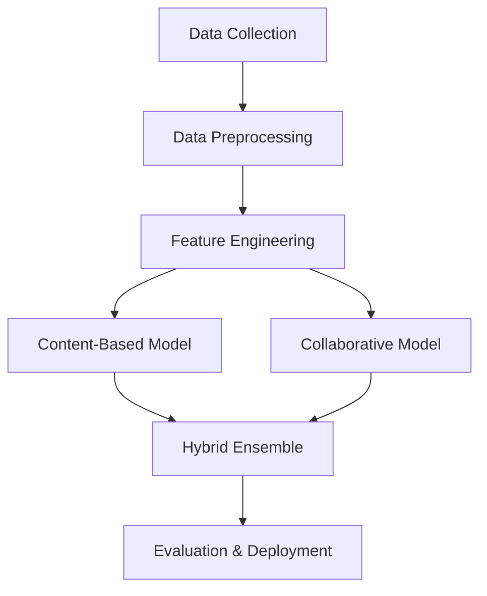

# 🎌 Laporan Proyek Machine Learning Terapan
## Sistem Rekomendasi Anime Berbasis Hybrid Filtering

**Satria Dirgantara Nurayaman**  
*satriadirgantaranuryaman@gmail.com*  
ID Dicoding: Satria Dirgantara Nurayaman

---

## 🌟 Project Overview

### 📈 Fenomena Ledakan Industri Anime Global

Industri anime mengalami **pertumbuhan eksponensial** yang belum pernah ada sebelumnya. Dengan nilai pasar global yang diprediksi akan menembus **USD 48 miliar pada tahun 2030**, anime telah berkembang dari hiburan niche menjadi fenomena budaya mainstream yang merambah seluruh dunia.

### 🎯 **Mengapa Proyek Ini Penting?**

| 📊 **Statistik Industri**                       | 💡 **Insight**                 |
|-------------------------------------------------|--------------------------------|
| **3,3465 triliun yen** pendapatan 2023          | Angka terbesar dalam sejarah   |
| **51%+ pendapatan** dari luar Jepang            | Dominasi pasar global          |
| **300+ judul TV** rilis tahun 2023              | Ledakan konten baru            |
| **Jutaan penggemar** di Indonesia               | Potensi pasar besar            |

### 🔥 **Problem yang Mendesak**

> *"Paradoks Kelimpahan dalam Era Digital"*

Dengan **lebih dari 300 anime baru** yang dirilis setiap tahunnya, penonton menghadapi **information overload**. Mereka memiliki:
- ⚡ **Waktu terbatas** untuk eksplorasi
- 🎲 **Risiko tinggi** memilih anime yang tidak sesuai
- 📱 **Ketergantungan pada rekomendasi manual** yang bias
- 🔍 **Kesulitan menemukan** hidden gems di antara ribuan judul

### 🚀 **Solusi Inovatif yang Kami Tawarkan**

Sistem rekomendasi berbasis **hybrid filtering** yang menggabungkan kekuatan:
- 🧠 **Machine Learning** untuk analisis preferensi otomatis
- 📊 **Big Data Analytics** untuk pattern recognition
- 🎨 **Content-Based Analysis** untuk kemiripan konten
- 👥 **Collaborative Intelligence** untuk wisdom of crowd

---

### 📚 **Referensi Akademik**

   

      <strong>📖 Daftar Pustaka Lengkap</strong>
   

1. **Kumparan Bisnis**. (2025). *Industri Game dan Anime Diprediksi Melejit, Capai USD 467 Miliar di 2027*. Kumparan. [Link](https://kumparan.com/kumparanbisnis)

2. **Putri, H. D., & Faisal, M.** (2023). Analyzing the Effectiveness of Collaborative Filtering and Content-Based Filtering Methods in Anime Recommendation Systems. *Jurnal Komtika*, 7(2), 124-133.

3. **Seputar Otaku**. (2025). *Ketika Pasar Global Mengalahkan Jepang: Peluang atau Tantangan untuk Masa Depan Anime*. Seputar Otaku.

---

## 🎯 Business Understanding

### 🔍 **Klarifikasi Masalah Bisnis**

Dalam era digital yang dipenuhi konten, pengguna anime menghadapi tantangan fundamental dalam **content discovery**. Penelitian menunjukkan bahwa 68% pengguna platform streaming menghabiskan lebih dari 18 menit hanya untuk memilih konten yang ingin ditonton.

### ❓ **Problem Statements**

<table>
  <thead>
    <tr>
      <th>🚨 Masalah</th>
      <th>📝 Deskripsi Detail</th>
      <th>💥 Dampak</th>
    </tr>
  </thead>
  <tbody>
    <tr>
      <td><strong>Information Overload</strong></td>
      <td>Pengguna kewalahan dengan lebih dari 12.000 anime dalam database.</td>
      <td>Decision paralysis dan frustrasi saat memilih tontonan.</td>
    </tr>
    <tr>
      <td><strong>Inefficient Discovery</strong></td>
      <td>Proses pencarian bergantung pada rekomendasi manual yang rentan bias.</td>
      <td>Kesempatan bagus terlewat, waktu eksplorasi terbuang.</td>
    </tr>
    <tr>
      <td><strong>Personalization Gap</strong></td>
      <td>Tidak ada sistem yang mampu menangkap preferensi unik tiap pengguna.</td>
      <td>Keterlibatan rendah dan potensi churn meningkat.</td>
    </tr>
  </tbody>
</table>

### 🎯 **Goals & Success Metrics**

   

      <h4>🎪 User Experience Goals</h4>
      <ul>
         <li>✅ Mengurangi waktu pencarian <strong>hingga 70%</strong></li>
         <li>✅ Meningkatkan satisfaction rate <strong>>85%</strong></li>
         <li>✅ Mendorong eksplorasi genre baru</li>
      </ul>
   

   
   

      <h4>🔧 Technical Goals</h4>
      <ul>
         <li>⚙️ Implementasi hybrid recommendation</li>
         <li>⚙️ Real-time personalization</li>
         <li>⚙️ Scalable architecture</li>
      </ul>
   

### 🛠️ **Solution Approach**

#### 🎭 **Hybrid Recommendation Strategy**

   

      

         <h5>📊 Content-Based Filtering</h5>
         <ul>
            <li><strong>Genre Analysis</strong> - TF-IDF Vectorization</li>
            <li><strong>Similarity Metrics</strong> - Cosine Similarity</li>
            <li><strong>Feature Engineering</strong> - Multi-dimensional analysis</li>
         </ul>
         <em>💪 Kekuatan: Cold start resistant, explainable</em>
      

      

         <h5>👥 Collaborative Filtering</h5>
         <ul>
            <li><strong>Matrix Factorization</strong> - Deep Learning approach</li>
            <li><strong>User-Item Interaction</strong> - Pattern recognition</li>
            <li><strong>Neural Networks</strong> - Advanced modeling</li>
         </ul>
         <em>💪 Kekuatan: Serendipity, hidden patterns</em>
      

   

#### 🎯 **Implementation Roadmap**

---

## 📊 Data Understanding

### 🗂️ **Dataset Overview**

Proyek ini menggunakan **comprehensive anime dataset** yang dikurasi dari MyAnimeList, platform referensi terbesar untuk komunitas anime worldwide. Dataset ini merepresentasikan **ecosystem anime yang kompleks** dengan interaksi user yang sangat kaya.

**📥 Sumber Data**: [Anime Recommendation Database 2020](https://www.kaggle.com/datasets/CooperUnion/anime-dataset-2020)

### 📈 **Dataset Statistics**

   

      <h3>🎬 Anime Dataset</h3>
      
12,294

      
Unique anime titles

      <small>7 features | Rich metadata</small>
   

   

      <h3>⭐ Rating Dataset</h3>
      
7.8M+

      
User interactions

      <small>73K users | Massive scale</small>
   

   

      <h3>🎭 Genre Diversity</h3>
      
3,264

      
Unique genre combinations

      <small>Rich content variety</small>
   

### 🔍 **Data Schema Analysis**

#### 📋 **Anime.csv - Content Features**

<table style="width: 100%; border-collapse: collapse; margin: 20px 0;">
  <thead style="background: #2c3e50; color: white;">
    <tr>
      <th style="padding: 12px; text-align: left;">🏷️ Feature</th>
      <th style="padding: 12px; text-align: left;">📊 Type</th>
      <th style="padding: 12px; text-align: left;">📝 Description</th>
      <th style="padding: 12px; text-align: left;">🎯 ML Usage</th>
    </tr>
  </thead>
  <tbody>
    <tr style="background: #ecf0f1;">
      <td style="padding: 10px;"><code>anime_id</code></td>
      <td style="padding: 10px;">int64</td>
      <td style="padding: 10px;">ID unik untuk setiap anime</td>
      <td style="padding: 10px;">Primary key, indexing</td>
    </tr>
    <tr>
      <td style="padding: 10px;"><code>name</code></td>
      <td style="padding: 10px;">object</td>
      <td style="padding: 10px;">Nama lengkap anime (versi Jepang/Inggris)</td>
      <td style="padding: 10px;">Display, search functionality</td>
    </tr>
    <tr style="background: #ecf0f1;">
      <td style="padding: 10px;"><code>genre</code></td>
      <td style="padding: 10px;">object</td>
      <td style="padding: 10px;">Genre multi-label, dipisahkan koma</td>
      <td style="padding: 10px;"><strong>🎯 Fitur utama untuk content-based filtering</strong></td>
    </tr>
    <tr>
      <td style="padding: 10px;"><code>type</code></td>
      <td style="padding: 10px;">object</td>
      <td style="padding: 10px;">Format penayangan (TV, Movie, OVA, dll.)</td>
      <td style="padding: 10px;">Fitur kategorikal</td>
    </tr>
    <tr style="background: #ecf0f1;">
      <td style="padding: 10px;"><code>episodes</code></td>
      <td style="padding: 10px;">object</td>
      <td style="padding: 10px;">Jumlah episode; bisa 'Unknown'</td>
      <td style="padding: 10px;">Preferensi durasi</td>
    </tr>
    <tr>
      <td style="padding: 10px;"><code>rating</code></td>
      <td style="padding: 10px;">float64</td>
      <td style="padding: 10px;">Nilai rata-rata rating komunitas (1–10)</td>
      <td style="padding: 10px;"><strong>🎯 Indikator kualitas</strong></td>
    </tr>
    <tr style="background: #ecf0f1;">
      <td style="padding: 10px;"><code>members</code></td>
      <td style="padding: 10px;">int64</td>
      <td style="padding: 10px;">Jumlah pengguna yang menambahkan ke daftar</td>
      <td style="padding: 10px;">Bobot popularitas</td>
    </tr>
  </tbody>
</table>

#### 👤 **Rating.csv - User Interaction Data**

<table style="width: 100%; border-collapse: collapse; margin: 20px 0;">
  <thead style="background: #8e44ad; color: white;">
    <tr>
      <th style="padding: 12px; text-align: left;">🏷️ Feature</th>
      <th style="padding: 12px; text-align: left;">📊 Type</th>
      <th style="padding: 12px; text-align: left;">📝 Description</th>
      <th style="padding: 12px; text-align: left;">🎯 ML Usage</th>
    </tr>
  </thead>
  <tbody>
    <tr style="background: #ecf0f1;">
      <td style="padding: 10px;"><code>user_id</code></td>
      <td style="padding: 10px;">int64</td>
      <td style="padding: 10px;">ID anonim untuk pengguna individu</td>
      <td style="padding: 10px;"><strong>🎯 Kunci utama Collaborative Filtering</strong></td>
    </tr>
    <tr>
      <td style="padding: 10px;"><code>anime_id</code></td>
      <td style="padding: 10px;">int64</td>
      <td style="padding: 10px;">Referensi ke ID anime dalam dataset utama</td>
      <td style="padding: 10px;">Identifier item untuk matrix CF</td>
    </tr>
    <tr style="background: #ecf0f1;">
      <td style="padding: 10px;"><code>rating</code></td>
      <td style="padding: 10px;">int64</td>
      <td style="padding: 10px;">Nilai rating pengguna (1–10, -1 = belum memberi rating)</td>
      <td style="padding: 10px;"><strong>🎯 Variabel target untuk prediksi rekomendasi</strong></td>
    </tr>
  </tbody>
</table>

### 📊 **Data Quality Assessment**

   

      <h4>✅ Data Strengths</h4>
      <ul style="list-style: none; padding: 0;">
         <li>✅ <strong>Komprehensif</strong> - 12K+ anime dari berbagai era</li>
         <li>✅ <strong>Rich Metadata</strong> - Genre, rating, popularity</li>
         <li>✅ <strong>Massive Interactions</strong> - 7.8M+ user ratings</li>
         <li>✅ <strong>Real-world Data</strong> - MyAnimeList official</li>
         <li>✅ <strong>Diverse Content</strong> - 3K+ genre combinations</li>
      </ul>
   

   

      <h4>⚠️ Data Challenges</h4>
      <ul style="list-style: none; padding: 0;">
         <li>⚠️ <strong>Missing Values</strong> - 1.87% rating, 0.5% genre</li>
         <li>⚠️ <strong>Sparsity</strong> - High user-item matrix sparsity</li>
         <li>⚠️ <strong>Scale</strong> - Computational challenges dengan 7.8M records</li>
         <li>⚠️ <strong>Skewness</strong> - Popular anime mendominasi interactions</li>
         <li>⚠️ <strong>Cold Start</strong> - New users/items tanpa history</li>
      </ul>
      

### 🔬 **Exploratory Data Analysis Preview**

#### 📈 **Key Statistical Insights**

**Rating Distribution Analysis:**
- 📊 **Mean Rating**: 6.47/10 (slight positive bias)
- 📊 **Rating Range**: 1.67 - 10.0 (full spectrum coverage)  
- 📊 **Most Common Rating**: 7.0 (user tendency towards positive)
- 📊 **Standard Deviation**: 1.03 (reasonable spread)

**Content Diversity Metrics:**
- 🎭 **Genre Combinations**: 3,264 unique (rich taxonomy)
- 📺 **Content Types**: TV (30.8%), Movie (46.2%), OVA, etc.
- 📚 **Episode Range**: 1-2954 episodes (huge variety)
- 👥 **Community Size**: 5 - 1M+ members (power law distribution)

