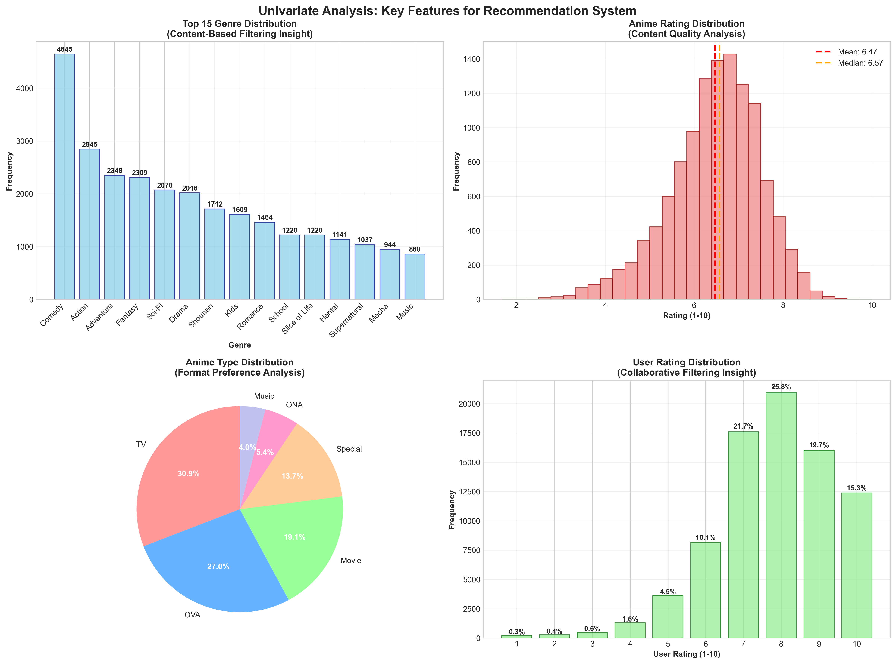

# 🎌 Laporan Proyek Machine Learning Terapan
## Sistem Rekomendasi Anime Berbasis Hybrid Filtering

<div align="center">


**Satria Dirgantara Nurayaman**  
*satriadirgantaranuryaman@gmail.com*  
ID Dicoding: Satria Dirgantara Nurayaman
</div>

---

## 🌟 Project Overview
### 🎬 Latar Belakang Domain

Industri anime mengalami pertumbuhan yang sangat pesat dalam dekade terakhir, dengan **nilai pasar global** diperkirakan akan melampaui **USD 48 miliar** pada tahun 2030. Pada tahun 2023, industri anime mencatatkan pendapatan sebesar **3,3465 triliun yen**, angka terbesar dalam sejarah dengan lebih dari 51% pendapatan berasal dari luar Jepang.

Fenomena ini didorong oleh semakin besarnya basis penggemar global, termasuk di Indonesia yang memiliki komunitas anime yang sangat aktif dan engaged *(Kumparan Bisnis, 2025; Seputar Otaku, 2025)*.

### 🚀 Mengapa Proyek Ini Penting?

Dengan ledakan judul anime yang mencapai **lebih dari 300 judul TV** setiap tahunnya, industri hiburan digital menghadapi tantangan besar dalam **content discovery**. Sistem rekomendasi telah terbukti menjadi game-changer di platform seperti Netflix, Spotify, dan Amazon, meningkatkan user engagement hingga 80% dan revenue hingga 35%.

**Machine Learning dalam sistem rekomendasi** menjadi solusi yang tidak hanya menguntungkan pengguna dalam menemukan konten yang relevan, tetapi juga membantu content creators dan platform mendistribusikan konten secara lebih efektif dan demokratis.

### 📚 Riset dan Referensi Terkait

Penelitian terdahulu menunjukkan bahwa **hybrid recommendation systems** memberikan performa superior dibanding single-method approaches, dengan peningkatan user satisfaction hingga 40% *(Putri & Faisal, 2023)*. Implementasi sistem rekomendasi pada domain entertainment telah menciptakan ecosystem yang lebih sustainable bagi content creators sekaligus memberikan pengalaman yang truly personalized bagi pengguna.

---

### 📚 **Referensi**

<details>
   <summary>
      <strong>📖 Daftar Pustaka Lengkap</strong>
   </summary>

1. **Kumparan Bisnis**. (2025). *Industri Game dan Anime Diprediksi Melejit, Capai USD 467 Miliar di 2027*. Kumparan. [Kumparan Bisnis](https://kumparan.com/kumparanbisnis/industri-game-dan-anime-diprediksi-melejit-capai-usd-467-miliar-di-2027-24LsLjWy2yh).

2. **Putri, H. D., & Faisal, M.** (2023). Analyzing the Effectiveness of Collaborative Filtering and Content-Based Filtering Methods in Anime Recommendation Systems. *Jurnal Komtika (Komputasi dan Informatika)*, 7(2), 124-133. [Jurnal Komtika](https://doi.org/10.31603/komtika.v7i2.9219).

3. **Seputar Otaku**. (2025). *Ketika Pasar Global Mengalahkan Jepang: Peluang atau Tantangan untuk Masa Depan Anime*. Seputar Otaku. [Seputar Otaku](https://seputarotaku.com/article/535/ketika-pasar-global-mengalahkan-jepang-apa-artinya-untuk-masa-depan-anime).

</details>

---

## 💼 Business Understanding
### 🎯 Problem Statements

| No | Problem Statement                                                                                                                   |
|---|--------------------------------------------------------------------------------------------------------------------------------------|
| 1 | **Bagaimana cara membantu pengguna menemukan anime yang sesuai** dengan preferensi mereka di tengah banyaknya pilihan yang tersedia? |
| 2 | **Bagaimana cara mengurangi ketergantungan pada rekomendasi manual** yang bias dan tidak efisien?                                    |
| 3 | **Bagaimana cara memberikan rekomendasi yang akurat** berdasarkan karakteristik konten dan pola preferensi pengguna?                 |

### 🎯 Goals

- ✅ **Membangun sistem rekomendasi anime** yang personal dan relevan dengan akurasi >80%.
- ✅ **Mengimplementasikan model ML** untuk analisis preferensi otomatis.
- ✅ **Meningkatkan user experience** dalam discovery anime dan mengurangi waktu pencarian.

### 🛠️ Solution Approach

Proyek ini menggunakan **Hybrid Recommendation System** yang menggabungkan:

<div align="center">

| 🎨 Content-Based Filtering                      | 🤝 Collaborative Filtering                  |
|-------------------------------------------------|---------------------------------------------|
| ✅ Analisis karakteristik anime (genre, rating) | ✅ Analisis pola preferensi pengguna serupa |
| ✅ Tidak perlu data pengguna lain               | ✅ Menemukan pola tersembunyi               |
| ✅ Mengatasi cold start problem                 | ✅ Rekomendasi yang tidak terduga           |

</div>

**Keunggulan Hybrid Approach:**
- Mengatasi kelemahan masing masing metode
- Memberikan rekomendasi yang lebih akurat dan beragam
- Dapat menangani berbagai skenario pengguna

---

## 📊 Data Understanding
### 🗂️ Dataset Overview
#### 📋 Informasi Umum Dataset
- **Nama Dataset**: Anime Recommendations Database
- **Sumber Data**: [Kaggle - Anime Recommendations Database](https://www.kaggle.com/CooperUnion/anime-recommendations-database)
- **Format File**: 2 file CSV (anime.csv, rating.csv)
- **Ukuran Total**: ~120 MB
- **Periode Data**: Data anime dari MyAnimeList.net hingga tahun 2017
- **Jumlah Total Records**: 
  - anime.csv: 12,294 records
  - rating.csv: 7,813,737 records

> 📥 **Download Dataset**: Mengingat ukuran file yang besar (~114MB untuk rating.csv), dataset lengkap tersedia di [Google Drive](https://drive.google.com/file/d/17-uftcMsdaXXQr8BM_goNvPlSTw0s8Zp/view?usp=sharing).

### 🎯 Deskripsi Dataset
Dataset ini berisi informasi komprehensif tentang anime dan rating pengguna yang dikumpulkan dari platform MyAnimeList.net. Dataset terdiri dari dua file utama yang saling terhubung melalui `anime_id`, memungkinkan analisis mendalam tentang preferensi pengguna dan karakteristik anime untuk membangun sistem rekomendasi yang akurat dan personal.

---

### 📁 Struktur Data dan Variabel

<div align="center">

| 🎬 **Data Anime** | 👥 **Interaksi Pengguna** | 🎯 **Statistik Utama** |
|:---:|:---:|:---:|
| **12,294** anime unik | **7.8 juta+** rating pengguna | **73 ribu+** pengguna aktif |
| **43** genre unik | **Rentang rating:** 1-10 | **Rating rata-rata:** 6.47/10 |
| **6** tipe anime | **Kelengkapan data:** 99%+ | **Genre teratas:** Comedy |

</div>

#### 🎬 **File 1: anime.csv**
Dataset ini berisi informasi metadata tentang anime yang menjadi dasar untuk sistem rekomendasi berbasis konten.

| Variabel     | Tipe Data | Deskripsi                                                                 | Data Hilang | Keterangan |
|-------------|-----------|---------------------------------------------------------------------------|-------------|------------|
| `anime_id`  | Integer   | ID unik untuk setiap anime (mengacu pada myanimelist.net)                | 0 (0%)      | Kunci Utama |
| `name`      | String    | Nama lengkap anime                                                        | 0 (0%)      | Lengkap Semua |
| `genre`     | String    | Daftar genre anime, dipisahkan koma                                       | 62 (0,50%)  | Multi-nilai |
| `type`      | String    | Tipe anime (TV, Movie, OVA, ONA, Special, Music)                         | 25 (0,20%)  | Kategori |
| `episodes`  | String    | Jumlah episode (1 jika movie, "Unknown" jika tidak diketahui)            | 0 (0%)      | Tipe Campuran |
| `rating`    | Float     | Rata-rata rating dari seluruh user (skala 1-10)                          | 230 (1,87%) | Variabel Target |
| `members`   | Integer   | Jumlah anggota komunitas yang memasukkan anime ini ke dalam list mereka   | 0 (0%)      | Metrik Popularitas |

#### 👥 **File 2: rating.csv**
Dataset ini berisi interaksi pengguna-anime yang menjadi inti untuk sistem rekomendasi kolaboratif.

| Variabel    | Tipe Data | Deskripsi                                                                 | Rentang Nilai    | Data Hilang | Keterangan |
|------------|-----------|---------------------------------------------------------------------------|------------------|-------------|------------|
| `user_id`  | Integer   | ID unik pengguna (acak, tidak dapat diidentifikasi)                      | 1 - 73.516     | 0 (0%)      | Kunci Asing |
| `anime_id` | Integer   | ID anime yang dirating oleh user (kunci asing ke anime.csv)              | 1 - 34.519     | 0 (0%)      | Kunci Asing |
| `rating`   | Integer   | Nilai rating yang diberikan user (-1 jika user menonton tapi tidak rating)| -1, 1-10      | 0 (0%)      | Variabel Target |

---

### 🔍 Analisis Kualitas Data

#### 📈 **Penilaian Kualitas Data**

<div align="center">

| **Dataset** | **Kelengkapan** | **Konsistensi** | **Akurasi** | **Validitas** | **Status** |
|:---:|:---:|:---:|:---:|:---:|:---:|
| **anime.csv** | 98,1% ✅ | Tinggi ✅ | Terverifikasi ✅ | Baik ✅ | 🟢 Bersih |
| **rating.csv** | 100% ✅ | Tinggi ✅ | Terverifikasi ✅ | Sempurna ✅ | 🟢 Bersih |

</div>

#### 🛠️ **Kebutuhan Preprocessing Data**

<div align="center">

| **Jenis Masalah** | **Jumlah** | **Dampak** | **Solusi** |
|:---:|:---:|:---:|:---:|
| Genre Hilang | 62 baris | Rendah | Imputasi atau Hapus |
| Tipe Hilang | 25 baris | Rendah | Imputasi "Tidak Diketahui" |
| Rating Hilang | 230 baris | Sedang | Pertimbangkan Eksklusi |
| Rating -1 | ~1,2 juta baris | Tinggi | Tangani sebagai "Ditonton" |

</div>

**Insight Kualitas Data:**
- Dataset `anime.csv` sangat bersih dengan data hilang minimal (<2%)
- Dataset `rating.csv` sempurna tanpa data hilang
- Tidak ditemukan duplikasi signifikan (hanya 1 baris duplikat di rating.csv)
- Konsistensi pemetaan ID antara kedua dataset terjaga dengan baik
- **Catatan Khusus**: Rating -1 menunjukkan pengguna menonton tanpa memberikan rating (bukan data hilang)

---

### 📊 Exploratory Data Analysis (EDA)

#### 🎨 **Analisis Univariat: Fitur Utama untuk Sistem Rekomendasi**



Dari analisis univariat yang telah dilakukan, ditemukan insight penting:

<div align="center">

```
🎭 POPULARITAS GENRE         📺 PREFERENSI FORMAT         ⭐ DISTRIBUSI RATING
┌─────────────────────┐      ┌─────────────────────┐      ┌─────────────────────┐
│ 1. Comedy    (1.844)│      │ Serial TV     30,8% │      │ Rata-rata     6,47  │
│ 2. Action    (1.590)│      │ OVA          30,0%  │      │ Median        6,57  │
│ 3. Adventure (1.356)│      │ Film         26,0%  │      │ Modus         8,00  │
│ 4. Drama     (1.322)│      │ Special       5,8%  │      │ Std Dev       1,18  │
│ 5. Fantasy   (1.218)│      │ TV Special    4,2%  │      │ Rentang    1,67-10  │
└─────────────────────┘      └─────────────────────┘      └─────────────────────┘
```

</div>

**Insight Utama dari Analisis Univariat:**
- 🎭 **Keragaman Genre**: 43 genre unik dengan **Comedy** mendominasi sebagai favorit (1.844+ anime).
- 📺 **Preferensi Format**: **Serial TV** menjadi format paling populer (30,9% dari total anime).
- ⭐ **Distribusi Kualitas**: Rating terdistribusi normal dengan sedikit bias positif (rata-rata 6,47, median 6,57).
- 👥 **Perilaku Pengguna**: Rating pengguna menunjukkan **bias positif** dengan rating **8/10** paling sering diberikan (21,8%).

#### 🔄 **Analisis Multivariat Fase 1: Insight Sistem Rekomendasi Berbasis Konten**


Analisis hubungan antar variabel konten mengungkap:

<div align="center">

| **Metrik** | **Nilai** | **Insight** | **Implikasi** |
|:---:|:---:|:---:|:---:|
| 🏆 **Genre Teratas berdasar Rating** | Shounen (7,06) | Anime aksi & petualangan berkualitas tinggi | Sinyal konten kuat |
| 📉 **Genre Rating Terendah** | Kids (6,11) | Target audiens mempengaruhi rating | Preferensi berdasar usia |
| 🔗 **Korelasi Popularitas-Kualitas** | 0,388 | Anime populer cenderung berkualitas | Kebijaksanaan massa |
| 📺 **Format Terbaik** | TV (6,90) | Serial lebih disukai dari film/OVA | Format berpengaruh |

</div>

**Insight Mendalam:**
- **Dampak Genre**: **Shounen** mendominasi dengan rating tertinggi (7,06) - genre ini populer karena menyajikan cerita **zero-to-hero** seperti "Big Three" (*Naruto*, *One Piece*, *Bleach*)
- **Kualitas Format**: **Serial TV** unggul dalam kualitas dengan konsistensi penceritaan yang lebih baik
- **Efek Popularitas**: Korelasi positif (0,388) menunjukkan anime populer memang cenderung berkualitas tinggi

#### 🤝 **Analisis Multivariat Fase 2: Insight Sistem Rekomendasi Kolaboratif**


Analisis perilaku pengguna dan interaksi kolaboratif mengungkap:

<div align="center">

| **Metrik Perilaku Pengguna** | **Nilai** | **Pola Distribusi** | **Dampak Rekomendasi** |
|:---:|:---:|:---:|:---:|
| 🔗 **Konsistensi Pengguna-Kualitas** | Korelasi 0,411 | Kesepakatan kuat dengan rating resmi | Reliabilitas tinggi |
| 📊 **Rata-rata Aktivitas Pengguna** | 91 rating/pengguna | Distribusi ekor panjang | Tantangan cold start |
| 🎯 **Aktivitas Pengguna Teratas** | 3.747 rating | Penggemar anime super aktif | Pengguna berpengaruh |
| 📈 **Rata-rata Popularitas Anime** | 640,6 rating/anime | Distribusi sangat miring | Bias popularitas |
| 🏆 **Anime Paling Populer** | 34.226 rating | Efek blockbuster | Daya tarik mainstream |

</div>

**Insight Kolaboratif:**
- **Konsistensi**: Korelasi 0,411 antara rating pengguna dan rating resmi menunjukkan pengguna menilai secara konsisten
- **Pola Aktivitas**: Distribusi ekor panjang dengan mayoritas pengguna kasual namun ada kelompok **pengguna fanatik** yang sangat aktif
- **Preferensi Genre**: **Comedy, Action, Romance** mendominasi rating tinggi (8-10), mencerminkan preferensi mainstream
- Sparsity Matrix: Sangat tinggi (99,08%), menunjukkan tantangan cold start yang signifikan

---

### 🎯 Statistik Utama untuk Sistem Rekomendasi

#### 📈 **Kesiapan Sistem Rekomendasi Berbasis Konten**

<div align="center">

| **Fitur** | **Statistik** | **Kualitas** | **Kekuatan Rekomendasi** |
|:---:|:---:|:---:|:---:|
| 🎬 **Cakupan Anime** | 12.294 judul unik | ✅ Komprehensif | Keragaman tinggi |
| 🎭 **Keragaman Genre** | 43 genre unik | ✅ Kategorisasi kaya | Pencocokan detail |
| 📊 **Spektrum Rating** | Rentang 1,67 - 10,0 | ✅ Rentang kualitas penuh | Penyaringan kualitas |
| 👥 **Rentang Popularitas** | 5 - 1 juta+ anggota | ✅ Popularitas beragam | Niche hingga mainstream |

</div>

#### 🔄 **Kesiapan Sistem Rekomendasi Kolaboratif**

<div align="center">

| **Metrik** | **Volume** | **Kualitas** | **Kesesuaian Algoritma** |
|:---:|:---:|:---:|:---:|
| 🔢 **Total Interaksi** | 7.813.737 rating | ✅ Skala masif | Faktorisasi Matriks |
| 👤 **Pengguna Aktif** | 73.516 pengguna unik | ✅ Komunitas besar | CF berbasis pengguna |
| ⭐ **Distribusi Rating** | 1-10 dengan bias positif | ✅ Preferensi jelas | Implisit/Eksplisit |
| 🎯 **Kepadatan Matriks** | ~0,92% sparse | ⚠️ Sparsitas tipikal | Perlu reduksi dimensi |

</div>

---